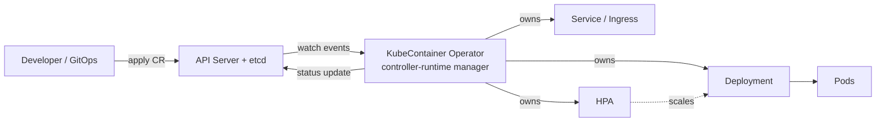

# KubeContainer — Design Document

KubeContainer is a Kubernetes operator that provides a single high-level abstraction —
the `KubeContainer` custom resource — for running a containerized workload. A user
declares *what* they want to run (image, ports, scaling, exposure); the operator
materializes and continuously manages the underlying Kubernetes primitives
(Deployment, Service, HorizontalPodAutoscaler, Ingress).

## Goals

- One small, opinionated CRD that covers the common case of "run this container,
  keep it healthy, scale it, and expose it".
- Full lifecycle automation: create, update (rollout), scale, expose, and clean up
  child resources when the CR is deleted.
- Self-healing: drift in any managed child resource is reverted on the next reconcile.
- Clear, observable state via status conditions and Kubernetes events.

## Non-Goals

- Replacing Helm or general-purpose templating — KubeContainer is deliberately opinionated.
- Managing stateful workloads (StatefulSets, PVC orchestration) in v1alpha1.
- Multi-cluster scheduling.

## Tech Stack

| Concern | Choice |
|---|---|
| Language | Go |
| Framework | Kubebuilder (controller-runtime) |
| API group | `kubecontainer.unboxd.cloud` |
| Initial version | `v1alpha1` |
| Testing | envtest (integration), kind (e2e) |
| Packaging | Multi-stage Docker image + Kustomize manifests under `config/` |

## Custom Resource

```yaml
apiVersion: kubecontainer.unboxd.cloud/v1alpha1
kind: KubeContainer
metadata:
  name: my-app
spec:
  image: ghcr.io/acme/my-app:1.4.2
  port: 8080                      # container port; also the Service target port
  env:                            # optional, standard corev1.EnvVar list
    - name: LOG_LEVEL
      value: info
  resources:                      # optional, standard corev1.ResourceRequirements
    requests: { cpu: 100m, memory: 128Mi }
  scaling:
    replicas: 2                   # fixed replica count, OR:
    autoscale:                    # mutually exclusive with replicas
      minReplicas: 2
      maxReplicas: 10
      targetCPUUtilization: 75
  expose:
    type: ClusterIP               # ClusterIP | LoadBalancer | Ingress
    host: my-app.example.com      # required when type=Ingress
  healthCheck:                    # optional; wired to liveness+readiness probes
    path: /healthz
status:
  observedGeneration: 3
  availableReplicas: 2
  endpoint: my-app.default.svc.cluster.local:8080
  conditions:
    - type: Ready                 # Ready | Progressing | Degraded
      status: "True"
      reason: DeploymentAvailable
```

Validation (CEL rules + webhook later if needed):
- `replicas` and `autoscale` are mutually exclusive.
- `expose.host` is required iff `expose.type == Ingress`.

## Architecture



### Controller

A single reconciler registered with a controller-runtime manager:

- `For(&KubeContainer{})` — reconciles on CR changes.
- `Owns(Deployment)`, `Owns(Service)`, `Owns(Ingress)`, `Owns(HPA)` — child changes
  (including external drift or deletion) re-enqueue the parent CR.

### Reconcile loop

1. Fetch the `KubeContainer`; if gone, exit (children are garbage-collected via owner references).
2. Build the desired child objects from `spec`.
3. `CreateOrUpdate` each child, setting the CR as controller owner reference.
   - If `scaling.autoscale` is unset, delete any orphaned HPA (and vice versa: the
     HPA owns the replica count, so the Deployment's `replicas` field is left unmanaged).
   - Same orphan-cleanup applies when `expose.type` changes (e.g. Ingress → ClusterIP).
4. Compute status: mirror Deployment availability into `Ready`/`Progressing`/`Degraded`
   conditions, set `availableReplicas`, `endpoint`, and `observedGeneration`.
5. Patch status (server-side apply) only when it changed, to avoid hot-looping.

The loop is idempotent and level-triggered — every pass converges actual state toward
`spec` regardless of which event woke it. No finalizer is needed in v1alpha1 because
all children live in the same namespace and are cleaned up by owner references.

### Failure handling & observability

- Transient errors return an error from `Reconcile` so controller-runtime retries
  with exponential backoff.
- Terminal misconfigurations (e.g. invalid image ref rejected by the API) set
  `Degraded=True` with a reason instead of retrying forever.
- Emit Kubernetes events on child create/update and on degradation.
- Standard controller-runtime Prometheus metrics, plus `/healthz` and `/readyz` probes
  on the manager.

## Image Artifacts

The operator ships as a single OCI image built by the multi-stage `Dockerfile`:

- **Build stage** — `golang:<pinned patch version>` (kept in sync with `go.mod`),
  compiling a static manager binary with `CGO_ENABLED=0` for `TARGETOS/TARGETARCH`.
- **Runtime stage** — `gcr.io/distroless/static:nonroot`: no shell or package
  manager, runs as a non-root user; the image contains only the manager binary.
- **Multi-arch** — `make docker-buildx` builds and pushes `linux/amd64` and
  `linux/arm64` manifests via Docker Buildx.
- **Tagging** — immutable semver tags (`vX.Y.Z`) matching git tags; `IMG` is
  injected into the manager Deployment by Kustomize (`config/manager/`).
  Mutable tags (`latest`) are not deployed.

Workload images (the `spec.image` users run *with* KubeContainer) are
deliberately out of scope: the operator treats them as opaque references and
never builds, scans, or mutates them.

## Distribution & Supply-Chain Policy

The project is **vendor-neutral by policy**: no vendor lock-in, no avoidable
supply-chain dependency, no supply-chain risk. Concretely:

- **CNCF-graduated standards only** for every required dependency and
  interface: Kubernetes APIs (stable groups only — `apps/v1`, `core/v1`,
  `networking.k8s.io/v1`, `autoscaling/v2`), OCI images and registries,
  Prometheus metrics exposition, and Helm (CNCF graduated) if/when chart
  packaging is added. Anything below graduated maturity (incubating/sandbox)
  may be *supported*, never *required*.
- **No ecosystem coupling for installation.** The canonical artifact is plain,
  kubectl-applyable YAML (`dist/install.yaml`). OLM/OperatorHub bundles,
  cloud-marketplace listings, and similar vendor channels are optional
  add-ons that must never become the only path — the project must install on
  any conformant Kubernetes cluster with `kubectl` alone.
- **Minimal, pinned, upstream-only dependencies.** Go modules limited to
  k8s.io/sigs.k8s.io libraries; build tools (kustomize, controller-gen,
  golangci-lint, setup-envtest) pinned to exact versions in the Makefile and
  fetched from upstream sources; base images pinned (`golang:1.25.7`,
  distroless). The operator phones home to nothing.
- **Hardening roadmap:** checksum verification for downloaded tools, image
  signing and provenance attestations (Sigstore/SLSA) on release artifacts,
  and SBOM publication.

## Project Layout (Kubebuilder standard)

```
api/v1alpha1/          # KubeContainer types, deepcopy, CEL markers
internal/controller/   # reconciler + child-object builders
config/                # CRD, RBAC, manager manifests (Kustomize)
test/e2e/              # kind-based end-to-end tests
```

## Authorization: OpenFGA Alignment

Coarse-grained access is Kubernetes RBAC and always sufficient on its own (the
supply-chain policy requires the operator to be fully functional with graduated
standards alone). For fine-grained, relationship-based authorization the
project is **OpenFGA-aligned and supports it out of the box** as an optional
integration:

- **Model** — a published OpenFGA authorization model shipping with the
  project: types `user`, `team`, `namespace`, `kubecontainer` with relations
  such as `owner`, `editor`, `viewer` and inheritance (team membership,
  namespace ownership flowing down to workloads).
- **Enforcement point** — an optional validating webhook that, when an OpenFGA
  store is configured, answers admission with
  `Check(principal, relation, kubecontainer)` in addition to RBAC. No store
  configured → webhook admits and RBAC alone governs (fail-open to the
  graduated baseline, never to nothing).
- **Why ReBAC here** — delegation chains ("which principal authorized this
  agent, which agent acted for that one") are relationship graphs; OpenFGA
  evaluates them natively, which plain RBAC cannot. This implements
  governance function #2 (authorization) of `docs/AGENT-PLATFORM.md` for the
  workloads this operator manages.
- **Status** — OpenFGA is CNCF incubating: per policy it is *supported out of
  the box, never required*.

## Policy: OPA Compliance

Open Policy Agent is CNCF **graduated**, so unlike OpenFGA it may sit on the
required side of the policy line where needed. The project is **OPA-compliant
and implementable out of the box**:

- **Policy-as-code surface** — every decision the operator makes is driven by
  declarative object state (spec/status), so any KubeContainer is fully
  evaluable by OPA/Gatekeeper at admission with no operator changes. This is
  by construction: no imperative side channels.
- **Shipped policies** — the project ships example Gatekeeper
  `ConstraintTemplates` (under `config/policies/`, roadmap item) for the
  obvious guardrails: allowed image registries for `spec.image`, mandatory
  `resources.requests` when autoscaling, mandatory `healthCheck` in
  designated namespaces, Ingress host domain allowlists.
- **Division of labor** — three layers, innermost first: CEL validation on the
  CRD enforces *structural invariants* (always on, no dependencies);
  OPA/Gatekeeper enforces *organizational policy* (what is allowed here);
  OpenFGA answers *relationship authorization* (who may do it). Governance
  functions #3 and #2 of `docs/AGENT-PLATFORM.md`, respectively.

## Roadmap

1. **v1alpha1** — scaffold, CRD, reconciler for Deployment + Service, status conditions, envtest coverage.
2. **v1alpha2** — HPA + Ingress support, CEL validation, e2e suite.
3. **v1beta1** — conversion webhook, defaulting webhook, image update policy (auto-rollout on digest change).
4. **v1beta2** — shipped Gatekeeper `ConstraintTemplates` (`config/policies/`);
   OpenFGA fine-grained authorization webhook (optional, off by default) with
   the published relationship model.
